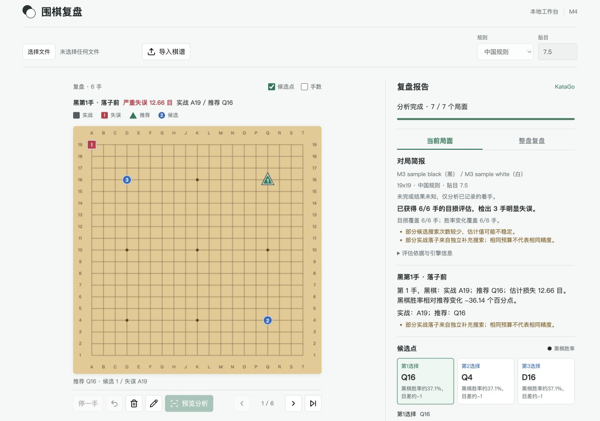
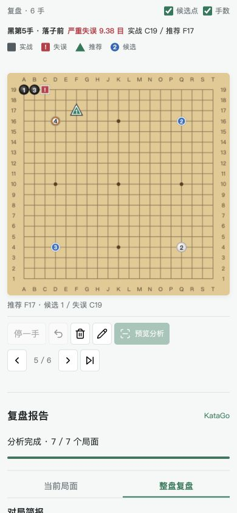

# M4 Acceptance

Date: 2026-08-29. Branch: `codex/m4-browser-workflow`, based on `bf002e0`.
Scope: complete the local browser workflow with bounded, cancellable real-engine
jobs. Public hosting and second-device acceptance remain M5, not this milestone.

## Automated Checks

- Full Python suite with real KataGo: **294 passed, zero skipped**, 44.64 seconds.
  Seven opt-in live cases cover prior model/pass/report checks plus actual batch
  progress and running-job cancellation with process reaping and a subsequent job.
- Frontend Node suite: **38 passed**. Includes existing rules, factual report and
  marker tests, plus API errors, snapshot/pass/undo behavior, stale validation,
  late submission/result cancellation, reconnect, expiry and canvas rendering.
- Job/API tests cover capacity rejection, queued/running cancellation, shutdown,
  timeout, sanitized failures, result size/count/TTL limits, replay numbering,
  immutable result copies, restored input, shared legacy capacity and exact CORS.
- The former monolithic HTML string test is now a small asset/control wiring
  check; it is not counted as browser acceptance.

Real engine environment: Apple M4 / 16 GiB, macOS arm64, Python 3.14.4,
KataGo 1.16.4 Metal and the existing b18 model/config from M2/M3. No weights,
private records or raw engine logs are added to Git.

## Browser Acceptance

Actual browser interactions against `http://localhost:3000/`, not direct API
calls substituted for clicks. The backend used real KataGo at its 200-visit
default. Only checked-in synthetic/public samples were used.

| Workflow | Observed result |
| --- | --- |
| Manual placement, pass, undo | Move count/player updated; undo restored the prior server snapshot |
| Occupied point | Chinese error identified move 2; accepted board stayed unchanged |
| Two consecutive passes | A third move was rejected as unsupported resumption; count stayed 3 |
| Manual confirmation and refresh | Submitted a two-move record with a test player name, reloaded while running, restored input and received a real 2/2 report with no qualifying mistakes |
| SGF upload | `m3_mistake.sgf` first showed a six-move preview with locked Chinese/7.5 metadata and no analysis until confirmation |
| Real mistake report | Complete 6/6 coverage; mistakes 1, 3, 5; observed losses 12.60, 12.19, 9.38 points (search observations, not exact future assertions) |
| Report/board navigation | Selected move 3, stepped to 4 and back, then selected move 5; board showed pre-move stones and separate actual/recommended markers |
| Upload error recovery | `m4-invalid.sgf` rejected an occupied point; another upload succeeded without reloading |
| Missing metadata | Empty komi blocked confirmation; choosing Japanese rules supplied 6.5 and updated the preview |
| Long-record cancellation | 235-move public sample showed 0/236 while the first batch ran; cancel reached terminal cancelled; resubmission was available |
| Input changes during submission | Resubmitted then immediately cleared; board stayed empty and no late report reappeared; reload also remained empty |
| Responsive layout | 1280x900, 390x844 and 320x760; no horizontal document overflow at either narrow width; board markers, controls and report remained usable |
| Completed-report refresh | Reloaded the final six-move report and restored it from the retained job; no browser errors/warnings were captured |

The final desktop rerun restored the completed report after a reload. Its search
values differ slightly from the earlier run, as expected:



The mobile screenshot records a real move-5 review, with four pre-move stones,
the red actual-mistake square and green recommended triangle:



Mock-based tests cover queue-full/offline/timeout/unavailable/expired/partial
paths. These are distinguished from the real browser observations above; not
every infrastructure fault was induced through the live browser.

After the final cache/header and UI recovery refinements, the non-live suite was
rerun: 287 passed, 7 intentionally skipped; the live browser report was rerun as
shown above. Dependency validation reported no broken requirements.

## Reproduction

With the environment activated and real model/config paths set as in README:

```bash
RUN_KATAGO_INTEGRATION=1 python -m pytest -q -ra
node --test tests/frontend/*.test.mjs
python scripts/local_server.py restart
git diff --check
```

Open localhost, enter a move/pass and undo it, preview and confirm; reload during
analysis. Import the synthetic mistake sample, confirm, select the chronological
mistake markers and navigate. Repeat at narrow widths. For the cancellation and
late-response flow, use the public long sample and cancel/clear before it ends.
`tests/frontend/workflow.test.mjs` contains deterministic delayed-response checks.

## Remaining Boundary

- One local instance, in-memory jobs; restart/expiry intentionally loses jobs.
- Progress advances by completed batches, not continuously during a search.
- A frontend-only Pages publication cannot run KataGo. M5 still needs an HTTPS
  backend, deployment limits, abuse protection and a second-device real review.
- Exact engine values vary with search. Existing thresholds still need product
  calibration; no new tactical explanations or LLM prose are introduced.

See [JOB_CONTRACT.md](JOB_CONTRACT.md) for concrete limits, retention, error
semantics and the explicit remote-origin configuration.
